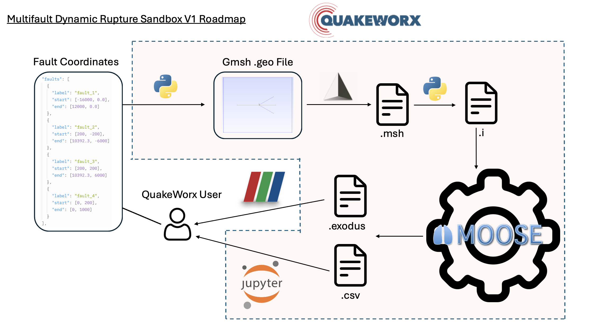

# CHANGELOG

## v2.0.0 — March 6, 2026

### Highlights

#### MultiFault SandBox: Automated Multi-Fault Dynamic Rupture Simulations

A new end-to-end pipeline for 2D multi-fault dynamic rupture simulations, driven entirely by a single JSON configuration file.



The figure above illustrates the complete MultiFault SandBox V1 pipeline. The workflow is fully automated — the QuakeWorx user only needs to provide a JSON configuration file defining fault coordinates, and the Python pipeline (`generate_multifault.py`) handles everything from geometry generation through simulation output.

**Pipeline stages (left to right in the figure):**

1. **Fault Coordinates (JSON config)** — The user defines fault geometries as start/end coordinate pairs (e.g., `fault_1: [-16000, 0] to [12000, 0]`), domain bounds, element size, material properties, initial stress patches, and solver settings in a single JSON file (`config/example_config_multifault.json`). The JSON snippet shown in the figure corresponds directly to the `"faults"` array in the config.

2. **Python pipeline (`generate_multifault.py`)** — The Python script reads the JSON config, validates all inputs (fault separation, domain bounds, stress patch overlaps), and orchestrates the remaining steps automatically.

3. **Gmsh `.geo` file** — The pipeline generates a Gmsh geometry file with the domain boundary, embedded fault lines as internal curves, deduplicated shared junction points, and physical curve labels per fault. This is the `.geo` box in the figure.

4. **`.msh` mesh** — Gmsh is invoked to produce a triangulated `.msh` mesh (MSH2 format) with faults embedded as internal boundaries. The script then uses `meshio` to read the mesh, identify elements adjacent to each fault, classify them as upper/lower using the fault normal direction, and assign subdomain IDs (`100/200`, `300/400`, ...) for `BreakMeshByBlock` CZM interface generation.

5. **`.i` MOOSE input file** — All computed data (element IDs, subdomain IDs, block pairs, boundary names, Functions, VectorPostprocessors) is substituted into a `.i` template to produce a ready-to-run MOOSE input file.

6. **MOOSE solver** — The generated `.i` file is executed by the MOOSE framework (the gear icon in the figure), running explicit time integration (`CentralDifference` lumped mass) with `SlipWeakeningFrictionczm2dParametricStudy` CZM materials, `NonReflectDashpotBC` absorbing boundaries, and `StiffPropDamping` Rayleigh damping.

7. **Simulation outputs** — MOOSE produces two output formats shown in the figure:
   - **`.exodus`** — Full-field displacement and stress visualization (viewable in ParaView)
   - **`.csv`** — Per-fault time series from `SideValueSampler` VectorPostprocessors, containing local shear/normal jump, jump rate, traction, and fault orientation vectors. Each fault gets its own CSV output file.

8. **Post-processing (Jupyter)** — As shown in the figure, the QuakeWorx user can load the `.csv` output directly in Jupyter notebooks for analysis, plotting slip evolution, rupture front tracking, and traction histories across all faults.

**Validation built in:**
- Fault crossing detection (segment intersection check)
- Minimum fault separation enforcement (2 x element_size)
- Domain boundary checks for all fault endpoints
- Overlapping stress patch detection
- Unique fault label enforcement

**Key files:**
- `applications/dynamicelastic_app/generate_multifault.py` — Pipeline script (923 lines)
- `applications/dynamicelastic_app/config/example_config_multifault.json` — Example: 4-fault system
- `applications/dynamicelastic_app/templates/multifault_2d.i.template` — MOOSE template
- `applications/dynamicelastic_app/2d_slipweakening_multifaults/` — Example output (4 faults, 12s simulation)

**Example usage:**
```bash
# Full pipeline (generates .geo, runs Gmsh, renders .i)
python generate_multifault.py config/example_config_multifault.json

# Preview without mesh generation
python generate_multifault.py config/example_config_multifault.json --dry-run

# Override output directory
python generate_multifault.py config/example_config_multifault.json --output-dir /tmp/my_run
```

---

### Breaking Changes

- Removed legacy 2D damage-breakage materials (`src/materials/cdbm/`)
- Removed legacy slip weakening materials (`src/materials/slipweakening/`, `src/materials/slipweakening3d/`)
- Removed legacy kernels (`src/kernels/cdbm/`, `src/kernels/cdbmtemp/`)
- Removed legacy functions (`src/functions/cdbm/`)
- Removed legacy auxkernels (`src/auxkernels/cdbm/`)
- Removed legacy interface kernel (`src/interfacekernels/slipweakening3d/FarmsCZM`)
- Removed all legacy examples (`examples/`) and integration tests (`test/tests/2D_slipweakening/`, `test/tests/3D_slipweakening/`)

### Added — New Modular Source Code (37 classes)

**Materials (18 classes):**
- `SlipWeakeningFrictionczm2d` — 2D CZM-based slip weakening friction
- `SlipWeakeningFrictionczm3d` — 3D CZM-based slip weakening friction
- `SlipWeakeningFrictionczm2dParametricStudy` — 2D with parametric study support (fractal stress, nucleation patches)
- `SlipWeakeningFrictionczm3dCDBM` — 3D slip weakening coupled with CDBM damage-breakage
- `ComputeGeneralDamageBreakageStressBase3D` — Refactored 3D CDBM base class (`src/materials/cdbm3dbase/`)
- `ComputeDamageBreakageStressBase3D` — Derived base for 3D damage-breakage
- `ComputeDamageBreakageStress3DSlipWeakening` — Dynamic CDBM with slip weakening fault coupling
- `ComputeDamageBreakageStress3DSlipWeakeningNonlocal` — Nonlocal regularized CDBM
- `ComputeDamageBreakageStress3DStatic` — Quasi-static CDBM solver
- `ComputeXi` — Strain invariant ratio helper (`src/materials/helper/`)
- `ElkNonlocalEqstrainUpdated` — Nonlocal equivalent strain material (`src/materials/nonlocaldamage/`)

**Functions (4 new classes):**
- `ForcedRuptureTimeCDBMv2` — Gaussian rupture time function for nucleation
- `InitialCohesionCDBMv2` — Piecewise linear cohesion vs. depth
- `InitialShearStressTPV2053d` — Spatial stress patches for TPV205 3D benchmark
- `InitialStressStrainTPV26` — Complex stress/strain initialization with tapering and overpressure

**AuxKernels (2 new classes):**
- `FDCompVarRate` — Finite-difference time derivative
- `FarmsMaterialRealAux` — Rotates global CZM quantities to local fault-aligned coordinates

**BCs, Kernels, UserObjects (relocated to `core/` directories):**
- `NonReflectDashpotBC`, `NonReflectDashpotBC3d` — Absorbing boundary conditions
- `StiffPropDamping` — Stiffness-proportional Rayleigh damping
- `ResidualEvaluationUserObject` — Residual recomputation with tagged vectors
- `ElkRadialAverageUpdated`, `ThreadedElkRadialAverageLoopUpdated` — Nonlocal spatial averaging

### Added — Application Presets

New `applications/` directory with 4 pre-configured application setups:
- `dynamicelastic_app/` — Elastic dynamic rupture (single-fault benchmarks + multi-fault sandbox)
- `dynamiccdbm_app/` — Damage-breakage coupled dynamic rupture
- `dynamiccdbm_f_app/` — Damage-breakage with fault coupling
- `dynamicporoelastic_app/` — Poroelastic dynamic rupture

### Added — JSON Configuration System (`dynamicelastic_app`)

- `generate_input.py` — Single-fault benchmark input generator (TPV205 2D/3D, TPV14 2D, TPV26 3D)
- `generate_multifault.py` — Multi-fault pipeline (see Highlights above)
- `config/defaults.json` — Benchmark preset defaults
- `config/example_config_*.json` — Example configurations for all benchmarks
- `templates/*.i.template` — MOOSE input templates (6 templates)
- `tests/test_generate_input.py` — 62 tests covering single-fault input generation, parameter validation, template rendering, and benchmark defaults
- `tests/test_generate_multifault.py` — 40 tests covering multi-fault pipeline, geometry validation, fault intersection detection, element extraction, and `.i` rendering

### Added — C++ Unit Test Suite

11 GoogleTest files in `unit/src/` with **107 test cases** covering all custom functions and core math:

| Test File | Tests | Coverage |
|-----------|-------|----------|
| `DamageBreakageMathTest.C` | 16 | CDBM gamma_r, alpha_cr, damage/breakage evolution, stress blending, Cd strain-rate, node mass (TRI3/QUAD4/TET4/HEX8), area, coefficients |
| `SlipWeakeningFrictionLawTest.C` | 16 | Friction at zero slip/Dc/beyond Dc, linear interpolation, open fault, sign convention, stuck condition, 3D slip magnitude, 3D traction projection |
| `InitialStressStrainTPV26Test.C` | 13 | Stress/strain modes, tapering above A / below B, overpressure, low effective stress, fluid pressure, error validation (6 EXPECT_THROW cases) |
| `XiComputationTest.C` | 11 | Pure volumetric/shear/uniaxial compression, initial value, off-diagonal strain, I1/I2 computation |
| `CoordinateRotationTest.C` | 8 | Horizontal/vertical/45-degree faults, orthogonality, unit length, full rotation invariance, traction rotation |
| `InitialShearStressTPV2053dTest.C` | 8 | Center/left/right patches, background stress, patch boundary inside/outside, time independence |
| `InitialStrikeShearStressPerturbRSF2DTest.C` | 8 | Zero at t=0, zero outside R, steady after T, monotonicity |
| `InitialStaticFrictionCoeffTest.C` | 7 | Inside/outside patch, patch boundary, custom parameters |
| `ForcedRuptureTimeCDBMv2Test.C` | 7 | At hypocenter, outside/at critical radius, monotonicity, symmetry |
| `InitialStrikeShearStressPerturbRSF3DTest.C` | 7 | 3D distance calculation, spatial-temporal perturbation verification |
| `InitialCohesionCDBMv2Test.C` | 6 | Surface, max depth, below max depth (clamped), mid-depth, negative z |

### Changed — Directory Restructuring

All source files reorganized into semantic subdirectories:

| Category | Old Location | New Location |
|----------|-------------|-------------|
| AuxKernels | `auxkernels/cdbm/` | `auxkernels/core/` |
| BCs | `bcs/` (flat) | `bcs/core/` |
| Functions | `functions/cdbm/` | `functions/slipweakeningczm/` |
| Kernels | `kernels/` (flat) | `kernels/core/` |
| Materials | `materials/cdbm/`, `materials/slipweakening/` | `materials/cdbm3dbase/`, `materials/slipweakeningczm/`, `materials/helper/`, `materials/nonlocaldamage/` |
| UserObjects | `userobjects/` (flat) | `userobjects/core/`, `userobjects/nonlocaldamage/` |

### Changed — Build System

- Updated `Makefile` for new directory structure
- Updated `unit/Makefile` with SOLID_MECHANICS module support
- Updated `.gitignore`

### Added — Developer Documentation

- `devdoc/UnitTest_Design_03062026.md` — Complete regression test design for all 37 classes
- `devdoc/json_config_system_plan.md` — JSON configuration system design
